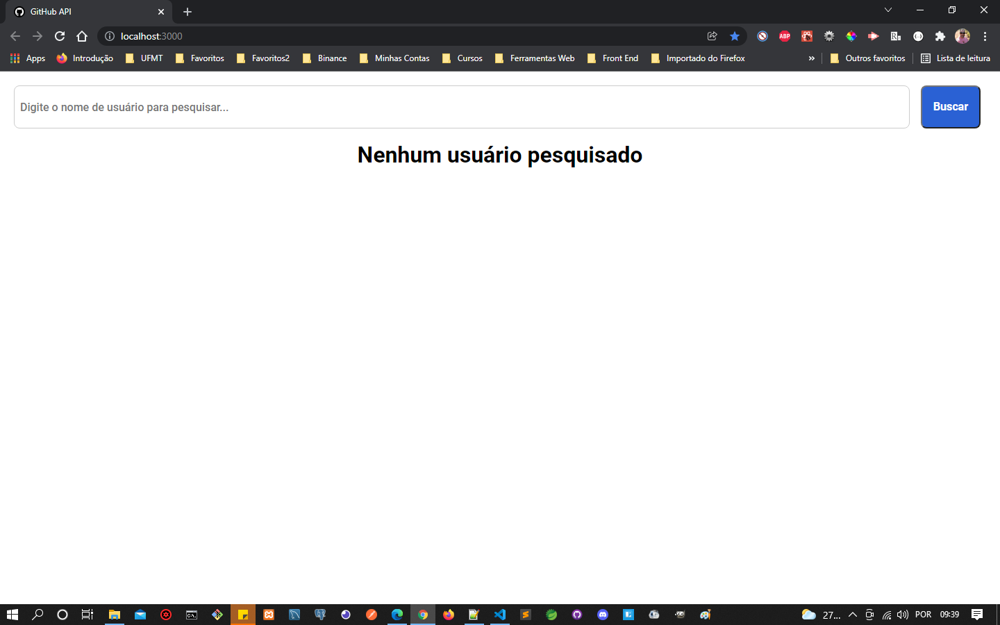
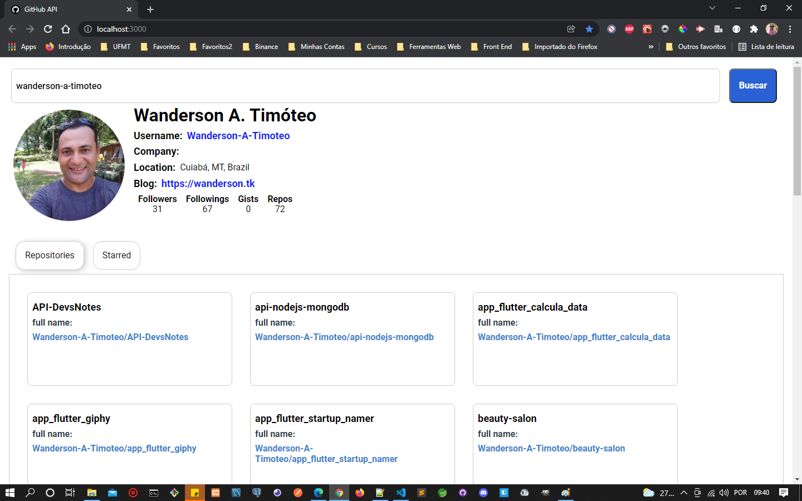
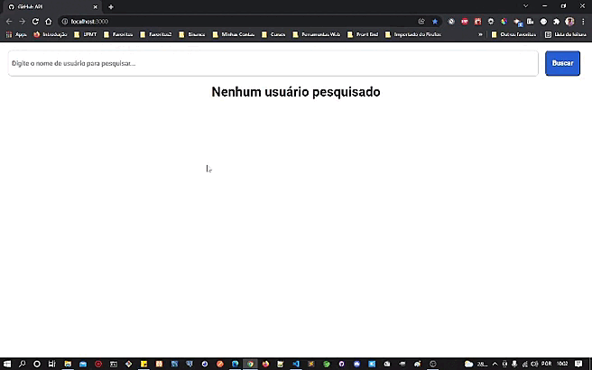

# GitHub Interface

## Projeto

Este projeto foi desenvolvido usando a API pública do github com o objetivo de mostrar como podemos criar uma aplicação frontend com componentes reutilizáveis.

## Recursos

-   Pesquisar informações por nome de usuário
-   Pesquisar repositório por nome de usuário
-   Pesquisa com estrela por nome de usuário

## Prévia vizualização da aplicação

Tela inicial.

<p align="center">
    
</p>
<br>

Tela mostrando a pesquisa pelo nome de usuário.

<p align="center">
    
</p>
<br>

Demostração:

<p align="center">
    
</p>
<br>

## 🚀 Tecnologias

Esse projeto foi desenvolvido com as seguintes tecnologias:

-   [React](https://pt-br.reactjs.org/)
-   [Axios](https://www.npmjs.com/package/axios)
-   [React Tabs](https://www.npmjs.com/package/react-tabs)
-   [Styled Components](https://styled-components.com/)

<br>

## Executar Aplicação

## 🔥 Executando Localmente a Aplicação

Caso você deseja executar o projeto na sua máquina local, você terá que instalar o Node.js. Após instalar, basta seguir os passos abaixo:

### 🌀 Começando...

Para começar, você deve simplesmente clonar o repositório do projeto na sua máquina e instalar as dependências.
<br>

#### ❗️ Instalando as Dependências (via Windows):

Abre o cmd (caso esteja utilizando o Windows) navegue até o local onde você clonou o projeto.

```
"C:\Users\NomeDoComputador\Documents\clonedoprojeto"
```

Quando estiver dentro da pasta do projeto **`github-api`**, digitar no cmd a seguinte instrução:

```
npm install
```

Ao digitar a instrução acima, automaticamente ele irá baixar todas as dependências listadas e definidas no arquivo package.json:

-   `node_modules` - que contêm os packages do npm que precisará para o projeto.

#### 💨 Executando a Aplicação

Bom, agora que já instalou as dependências **(dentro da pasta `github-api` do projeto clonado)** abra um terminal para o projeto ser executado e digite:

```
npm start
```

Pronto! dessa forma o projeto **`github-api`** estará rodando localmente em sua maquina, acesse:

```
http://localhost:3000
```

<br>

## 🚩 Tenho Dúvidas... O que fazer?

Caso tenham dúvidas sobre o código do projeto, sintam-se a vontade em abrir uma **[ISSUE AQUI](https://github.com/Wanderson-A-Timoteo/github-api/issues)**. Assim que possível, estarei respondendo a todas as dúvidas que tiverem!

<br>

## Licença

Esse projeto está sob a licença MIT. Veja o arquivo [LICENSE](LICENSE) para mais detalhes.

<br>

## Autor:

Feito com ♥ by

-   [**Wanderson A. Timóteo**](https://wanderson.tk)

<br>

## Agradecimentos:

<h1 align="center">
    
</h1>

-   Projeto desenvolvido durante as aulas na plataforma [Digital Innovation One](https://web.dio.me/sign-in).

-   Agradecimento a [Matheus Benites](https://github.com/benits) por compartilhar seu conhecimento com a comunidade dev.
